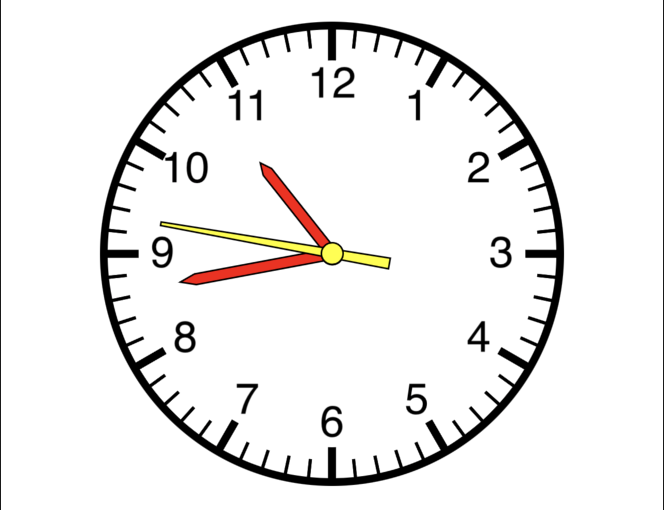
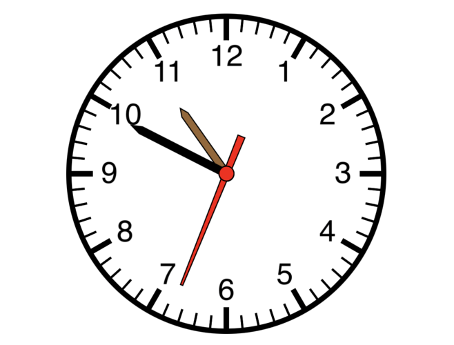
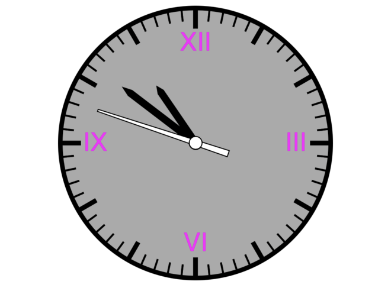
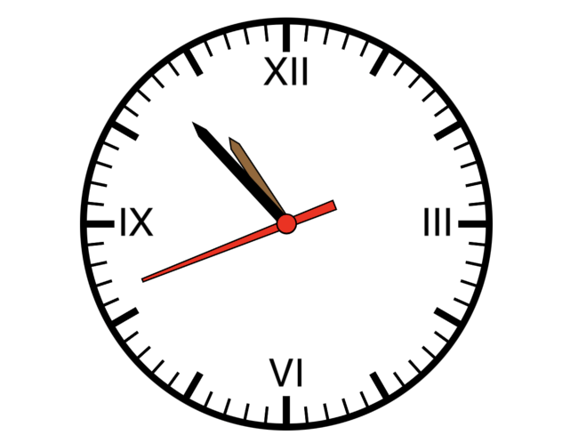
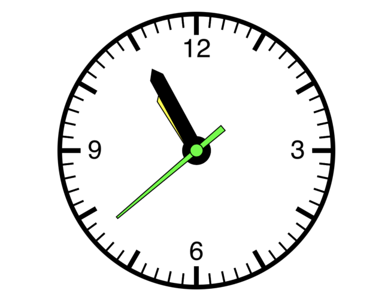
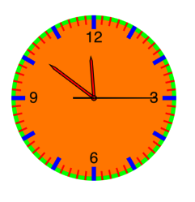
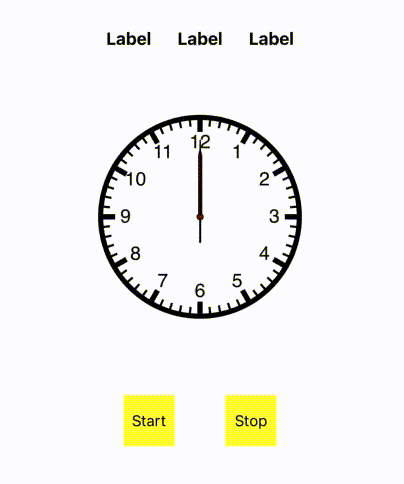
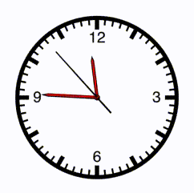

# SwiftAnalogueClock
A higly customisable Swift Analogue clock view.
-----------

     

## Add Dependencies
- Inside your podfile:
```xml
  target 'MyApp' do
    pod 'SwiftAnalogueClock', '~> 0.0'
  end
```
## Usage
- Inside your ViewController: Add an outlet or initiate the AnalogueClockView(). Customise as much as you want :)
```xml
  clockView.clockFillColor = .black
  clockView.clockLineWidth = 5
  .
  .
  .
```
- Set clock type to Roman, normal, etc.
```xml
  clockView.clockType = .roman
```
## StopWatch
- Convert to a stopWatch along with other look changes.
```xml
  clockView.clockType = .stopWatch
```
- Set delegate from parent class
```xml
  clockView.delegate = self
```
- Conform parent class to AnalogueClockProtocol
```xml
  class MyViewController: UIViewController, AnalogueClockProtocol {
    ..
    func time(hours: Int, minutes: Int, seconds: Int, ticks: Int) {
      // The stop time values
    }
    ..
  }
```


## Missing Tick Tick?
- Set the second hand movement to classic tick tick.
```xml
  clockView.tickTickAnimationEnabled = true
```


## Customisable
- SwiftAnalogueClock comes with a wide veriety of customisable properties
```xml
  // Clock View Customisation
    var hideMinuteLines: Bool
    var hideHourLines: Bool
    var showOnlyQuarterHourLines: Bool
    var hideHourMarking: Bool
    var tickTickAnimationEnabled: Bool
    var clockFillColor: UIColor
    var clockStrokeColor: UIColor
    var clockLineWidth: CGFloat
    var secondsHandHeightFactor: CGFloat
    var minutesHandHeightFactor: CGFloat
    var hoursHandHeightFactor: CGFloat
    var hoursMarkLineWidth: CGFloat
    var hoursMarkFillColor: UIColor
    var hoursMarkStrokeColor: CGFloat
    var minutesMarkLineWidth: CGFloat
    var minutesMarkFillColor: UIColor
    var minutesMarkStrokeColor: UIColor
    var clockType: ClockType?
  
  // Clock Hand Customisation
    var hourMarkingTextColor: UIColor
    var hideSecondsHand: Bool 
    var secondsHandFillColor: UIColor
    var secondsHandStrokeColor: UIColor
    var secondsHandLineWidth: CGFloat
    var secondsHandCustomPath: UIBezierPath
    var secondsHandWidth: CGFloat
    var minutesHandFillColor: UIColor
    var minutesHandStrokeColor: UIColor
    var minutesHandLineWidth: CGFloat 
    var minutesHandCustomPath: UIBezierPath
    var minutesHandWidth: CGFloat
    var hoursHandFillColor: UIColor
    var hoursHandStrokeColor: UIColor
    var hoursHandLineWidth: CGFloat 
    var hoursHandCustomPath: UIBezierPath
    var hoursHandWidth: CGFloat
```
